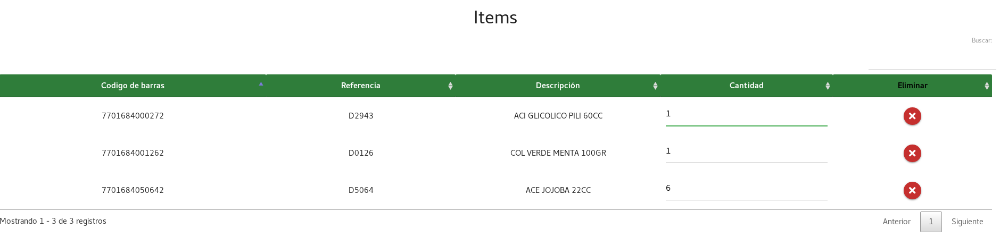

# Aplicación de bodega

Proyecto para automatizar el proceso de packing en drogueria usando PHP, JAVASCRIPT, HTML y base de datos MYSQL.

*****
## framework de diseño usados:

  * Fontawesome
  * Materialize

## Plugins y librerias de Javascript usados:

  * Datatable
  * Jquery
  * Sweetalert

## Sistema de gestion de base de datos usado:

  * Mysql

# Aplicación de bodega

## Login

<!--  -->

Al ingresar a la pagina principal se pedirá al usuario iniciar sesión, en dicha pagina el usuario deberá ingresar sus datos, de usuario y su contraseña.

### Tipós de usuario:
<ul>
  <li>
    Administrador:Pueden ver 
      <ul>
        <li>Subir archivo de requisicion</li>
        <li>Alistar</li>
        <li>Caja</li>
        <li>Pventa (Punto de venta)</li>
        <li>Usuarios</li>
      </ul>
  </li>
  <li>
    Jefe: Pueden ver
      <ul>
        <li>Subir archivo de requisicion</li>
        <li>Caja</li>
      </ul>
  </li>
  <li>
    Alistador: Pueden ver
      <ul>
        <li>alistar</li>
      </ul>
  </li>
  <li>
    Encargado punto de venta: Pueden ver
      <ul>
        <li>Pventa (Punto de venta)</li>
      </ul>
  </li>
</ul>

******

## Pagina Inicio
Al iniciar sesión se mostrara una pagina de inicio en el menú de navegación en la esquina superior izquierda, está el menú desplegable donde se podrán realizar diferentes acciones según el usuario.

Links de la pagina :
1. Subir archivo de requisición
2. Alistar
3. Caja
4. Pventa (Punto de venta)
5. Usuarios
6. Salir(Cerrar sesión)

****

## 1. Subir archivo de requisición

En esta pagina el usuario podrá subir el archivo plano de la requisición el cual alimentara la base de datos

### 1.1. Seleccionando archivo

### 1.2. Mensajes que puede mostrar la aplicación.

1. Si se sube un archivo que no sea de texto

2. Si no encuentra la requisición en el archivo plano

2. Si la requisición ya se subió a la base de datos

3. Si si el archivo se subió a la base de datos exitosamente

*****

## 2. Alistar

En esta pagina el usuario podrá seleccionar una requisición y alistar los items de dicha requisición en cajas. 

### 2.1. Seleccionar requisición

En la entrada de numero de requisición aparecen todas las requisiciones pendiente donde el usuario podrá seleccionar una de estas para hacer el alistamiento

#### 2.1.1 Cajas sin cerrar(enviar)

si hay cajas abiertas en otra requisición que no han sido enviadas a la base de datos la pagina no dejara alistar items hasta que dicha caja sea cerrada.

### 2.2. Tabla Items

Tabla donde se muestran los items de la requisición seleccionada, dicha tabla se actualiza cada vez que se cambia de requisición o si se agrega o quita un item de caja.

La tabla se organiza por pagina mostrando 5 items en cada una, además de tener una entrada de búsqueda que permite encontrar datos en dicha tabla

### 2.3. Código de barras

Al seleccionar la requisición se activa la entrada de código de barras donde se podrá ingresar el item. Dicha entrada solo permite el ingreso de números.

Para agregar un item a la caja solo basta con introducir el código de barras en la entrada correspondiente y presionar enter o dar click en el botón de agregar item

Si el item digitado es correcto se mostrara un mensaje a la derecha de la pantalla con el nombre del item agregado

El item agregado aparecerá en la tabla de Caja donde se podrá editar la cantidad a alistar o donde se podrá eliminar con el botón de eliminar item

#### 2.3.1. Errores al Cargar el item 

Es posible que el item no se pueda cargar en la caja, de ser así la pagina mostrara el mensaje en pantalla.

1. Si no se encuentra el item en la requisicion

2. Si el item ya esta siendo alistado por otro usuario

3. Si el item ya fue alistado en una caja

### 2.4. Tabla caja

En esta tabla se mostraran los items a alistar y se actualiza cada vez que es modifica, agrega o elimina un item de la tabla.

Si hay una caja sin cerrar de la requisición seleccionada la tabla mostrara los items de dicha caja.

#### 2.4.1. Tipo de caja

En el menú de selección inferior izquierdo se podrá seleccionar el tipo de caja en el que se introducirán los items.

#### 4.4.2. Cerrar Caja

Las caja se cierran y haciendo click en el botón de cerrar caja, que mostrara un ventana de confirmación.

Si al hacer click en cerrar la caja con sus items son almacenado exitosamente en la base de datos se mostrara un mensaje confirmando la creación de la caja. y se reiniciara la pagina.

*****

## 3. Cajas

En esta pagina el usuario podrá ver las cajas creadas por los alistadores y generar un archivo plano para enviar la caja.

### 3.1. Seleccionar requisición

En la entrada de numero de requisición aparecen todas las requisiciones pendiente donde el usuario podrá seleccionar una de estas para poder ver las cajas correspondientes.

### 3.2. tabla cajas

al seleccionar una requisición en una tabla se mostraran todas las cajas correspondientes a ta requisición.

Para cada caja se muestra su numero, el nombre de alistador, la fecha en que se abrió y cerro la caja y el tipo de caja:

* **CRT**: Caja de cartón.
* **CPL**: Caja plástica.
* **CAP**: Canasta plástica.
* **GLN**: Galón.
* **GLA**: Galoneta. 

### 3.3 Revisar caja

Presionando el botón de revisar a la izquierda de cada caja se puede ver su contenido.

Dentro de esta ventana se puede agregar un texto corta para cada item no mayor a 20 caracteres

#### 3.3.1. Generar Documento

Para generar el documento es necesario hacer click sobre el botón Generar documento en la esquina inferior de la pantalla de cada caja.

Archivo plano generado:

## 4. PV (Punto de Venta)

En esta pagina el usuario podrá revisar los items que llegaron de una requisición al punto de venta y generar un documento de los items recibidos en comarcaron a los enviados.

### 4.1. Seleccionar requisición

En la entrada de numero de requisición aparecen todas las requisicones.

### 4.2. Seleccionar caja

Al seleccionar una requisición aparecerá una opción donde se podrá seleccionar alguna de las cajas que ya fueron enviadas al punto.

### 4.3. Agregar Item.

En la entrada de código de barras se digital el código de barras del item y al presionar enter o dar click en agregar item dicho item es añadido a la tabla. si se pasan varias veces el mismo item este se acumulara.

### 4.4. Tabla items

En la tabla Items aparecen todos los items pasado por el código de barras, dichos items se pueden eliminar de la tabla con el botón de eliminar o se puede modificar su cantidad.

### 4.5 Registrar item

para Registrar los items hay que presionar el botón de registrar en la esquina inferior izquierda de la pagina, esto abrirá una pagina de confirmaron

Si se da click en confirmar se generara un documento de texto de los items recibidos.

Archivo plano generado:

